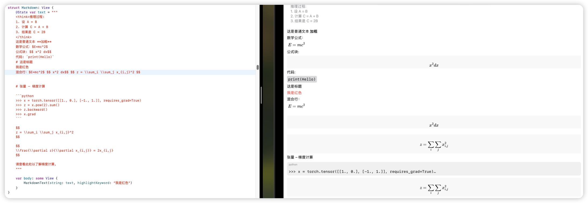

# TextMarkupKit

A Swift package that provides components for rendering rich text with Markdown, LaTeX, and code blocks in SwiftUI.

[中文说明](#中文说明)

## Preview



*TextMarkupKit rendering Markdown text with LaTeX formulas, code blocks and collapsible sections*

## Features

- Markdown text rendering with SwiftUI
- LaTeX formula support (powered by [LaTeXSwiftUI](https://github.com/colinc86/LaTeXSwiftUI))
- Code blocks with language syntax indicator
- Collapsible "Think" sections (wrapped in `<think>` tags)
- Keyword highlighting

## Installation

Add this package to your Xcode project using Swift Package Manager:

```swift
dependencies: [
    .package(url: "https://github.com/ALANotFound/TextMarkupKit", from: "1.0.0")
]
```

## Usage

### Basic Markdown

```swift
import TextMarkupKit

struct ContentView: View {
    var body: some View {
        MarkdownText(string: "# Hello\n\nThis is **bold** and this is *italic*.")
    }
}
```

### With LaTeX

```swift
MarkdownText(string: "The formula $E=mc^2$ is famous.")
```

For block LaTeX:

```swift
MarkdownText(string: """
# Einstein's Energy Equation

$$
E = mc^2
$$
""")
```

### With Code Blocks

```swift
MarkdownText(string: """
# Hello World in Swift

```swift
func greet(name: String) {
    print("Hello, \\(name)!")
}
```
""")
```

### With Keyword Highlighting

```swift
MarkdownText(
    string: "The quick brown fox jumps over the lazy dog.", 
    highlightKeyword: "fox"
)
```

### With Thinking Section

```swift
MarkdownText(string: """
<think>
This is a hidden reasoning process that can be expanded.
It contains detailed explanation of the thought process.
</think>

# Conclusion
Based on my analysis, the answer is 42.
""")
```

## Requirements

- iOS 14.0+ / macOS 12.0+
- Swift 5.9+
- Xcode 15.0+

## Credits

This package depends on [LaTeXSwiftUI](https://github.com/colinc86/LaTeXSwiftUI) for LaTeX rendering capabilities.

## License

TextMarkupKit is available under the MIT license. See the LICENSE file for more info.

---

# 中文说明

TextMarkupKit 是一个 Swift 软件包，提供了在 SwiftUI 中渲染 Markdown 文本、LaTeX 公式和代码块的组件。

## 预览


*TextMarkupKit 渲染 Markdown 文本，包含 LaTeX 公式、代码块和可折叠部分*

## 特性

- 使用 SwiftUI 渲染 Markdown 文本
- 支持 LaTeX 公式（由 [LaTeXSwiftUI](https://github.com/colinc86/LaTeXSwiftUI) 提供支持）
- 代码块显示，带有语言语法标识
- 可折叠的"思考"部分（用 `<think>` 标签包裹）
- 关键词高亮显示

## 安装

使用 Swift Package Manager 将此软件包添加到您的 Xcode 项目中：

```swift
dependencies: [
    .package(url: "https://github.com/YOUR_USERNAME/TextMarkupKit", from: "1.0.0")
]
```

## 使用方法

### 基础 Markdown

```swift
import TextMarkupKit

struct ContentView: View {
    var body: some View {
        MarkdownText(string: "# 你好\n\n这是**粗体**，这是*斜体*。")
    }
}
```

### 使用 LaTeX 公式

```swift
MarkdownText(string: "著名的公式 $E=mc^2$")
```

对于块级 LaTeX 公式：

```swift
MarkdownText(string: """
# 爱因斯坦能量方程

$$
E = mc^2
$$
""")
```

### 使用代码块

```swift
MarkdownText(string: """
# Swift 中的 Hello World

```swift
func greet(name: String) {
    print("你好，\\(name)！")
}
```
""")
```

### 使用关键词高亮

```swift
MarkdownText(
    string: "敏捷的棕色狐狸跳过了懒惰的狗。", 
    highlightKeyword: "狐狸"
)
```

### 使用思考部分

```swift
MarkdownText(string: """
<think>
这是一个隐藏的推理过程，可以展开查看。
它包含了思考过程的详细解释。
</think>

# 结论
根据我的分析，答案是 42。
""")
```

## 系统要求

- iOS 14.0+ / macOS 12.0+
- Swift 5.9+
- Xcode 15.0+

## 致谢

此软件包依赖 [LaTeXSwiftUI](https://github.com/colinc86/LaTeXSwiftUI) 提供 LaTeX 渲染功能。

## 许可证

TextMarkupKit 基于 MIT 许可证发布。详情请查看 LICENSE 文件。 
